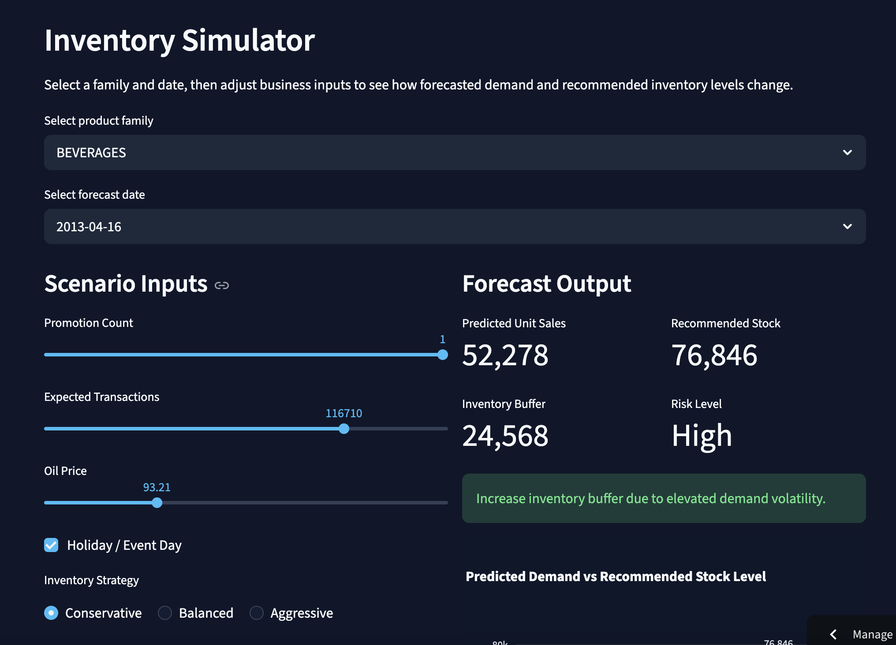
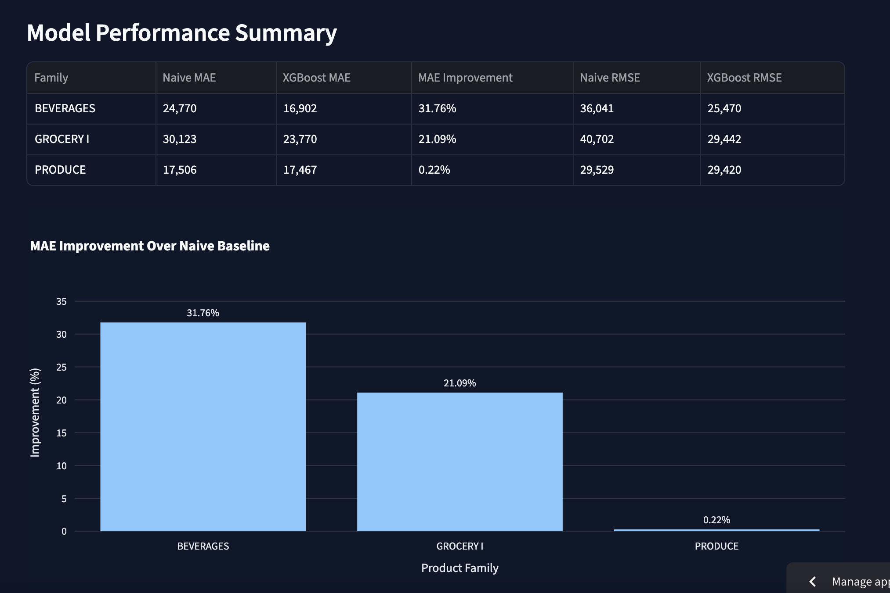

# Overview

This project is an end-to-end pipeline that forecasts category-level demand and converts predictions into operational inventory recommendations through an interactive Streamlit app using the  Corporación Favorita grocery dataset. 

The project then moves beyond forecasting accuracy and pivots to a more realistic business objective: using predictive analytics to support stocking decisions under changing market conditions. The final system combines:

- Time-series feature engineering
- Category-specific XGBoost forecasting models
- Benchmark comparison against naive forecasts
- Volatility-informed logic for unstable categories
- An interactive scenario simulation for operations teams

# Live Dashboard

[View Interactive Dashboard Here](https://retail-demand-forecasting-and-inventory-optimization-f27yhgzln.streamlit.app/)

Using this dashboard users may:

- Compare forecast performance across categories
- Visualize actual vs predicted demand
- Simulate changes in promotions, traffic, holidays, etc.
- Receive recommended inventory levels based on risk

# Business Context

Retail inventory management is a significant forecasting problem that bears real financial consequences.

If future demand is underestimated:

- Shelves go empty
- Potential sales are lost
- Customer retention drops as they switch brands or stores

If demand is overestimated:

- Excess working capital becomes tied up
- Perishables, such as produce or dairy, spoil
- Markdown risk and further loss of revenue increases

The challenge becomes more prominent yet when demand shifts due to:

- In-store promotions
- Holidays
- Customer traffic changes
- Macroeconomic effects (oil prices, etc.)
- Category volatility

This project was designed to model those dynamics and produce actionable decision support outputs.

# Dataset

This project uses the Corporación Favorita Grocery Sales Forecasting dataset. It can be found by clicking the link below.

[Grocery Dataset](https://www.kaggle.com/competitions/favorita-grocery-sales-forecasting)

The dataset contains historical transaction data from a major Ecuadorian grocery retailer.

The categories modeled were:

- Beverages
- Grocery I
- Produce

Additional merged signals:

- Daily transaction counts
- Promotion counts
- Holidays/special events
- Oil Prices
- Calendar seasonality

# Why Category-Level Forecasting?

Instead of forecasting every SKU individually, this project forecasted demand at the **product-family level**.

Benefits of forecasting at the product-family level include:

- Reduction of noise relative to SKU-level demand
- Easier operational planning
- Enhanced strategic inventory decisions
- Computational efficiency for rapid experimentation

This choice also mirrors how many real business teams plan at aggregate levels before drilling deeper into data.

# Feature Engineering

A major focus of this project was transforming raw sales history into predictive signals through the implementation of feature engineering.

## Lag Features

Lag features represent prior demand values.

Examples:

- lag_1 = yesterday's sales
- lag_7 = same weekday last week
- lag_14 = two weeks ago
- lag_28 = approx. one month ago

The usage of lag features is useful in that retail demand is highly autocorrelated. Recent sales often contain strong information about near-future sales.

## Rolling Statistics

Examples:

- rolling_mean_7
- rolling_mean_14
- rolling_mean_28
- rolling_std_14

Rolling statistical features are useful as they summarize short-term trend and volatility. For example:

- Rising rolling mean may indicate momentum
- High rolling std may indicate unstable demand requiring larger buffers in inventory stock

## Calendar Features

- Day of week
- Month
- Quarter
- Week of year
- Cyclical sine/cosine encodings

Calendar features are useful in that retail demand often follows recurrent weekly and seasonal (modeling by sine and cosine encodings) cycles.

Examples:

- Weekend beverage spikes
- Holiday produce surges
- Monthly shopping behavior

# Business Drivers

- Promotion counts
- Transaction volume
- Oil prices
- Holiday Flags

Such features are useful as they correlate with real-world demand shifts that go beyond pure sales history.

# Modeling Approach

## Baseline: Naive Forecast

The naive forecast model used previous demand levels as a benchmark. In time series forecasting, beating a naive baseline, which already tends to be strong, is essential. Many models fail to outperform these simple models due to their already inherent robustness. 

This project explicitly evaluated model lift against that benchmark.

## Main Model: XGBoost

XGBoost was selected as it performs strongly on structure/tabular data with nonlinear relationships.

Reasons for choosing XGBoost:

- Handles mixed feature types well
- Captures interactions automatically
- Strong performance on engineered tabular datasets
- Often outperforms baseline models
- Interpretable via feature importance

Separate models were trained per grocery category. 

## Log- Transformed Targets

Log-transformed targets were used for more stable categories, such as Grocery I, to reduce skew and help the model handle larger sales ranges.

# Category-Specific Logic: Produce

Produce demand was materially more volatile than other categories and achieving a model that performed better than baseline (with primary evaluation metrics being MAE and RSME scores) was difficult.

Likely reasons:

- Perishability
- Weather sensitivity
- Holiday surges
- Promotional spikes
- Consumer variability

Standard XGBoost predictions were less stable here, leading to the seeking of an alternative solution. 

To handle the volatility, a conservative shrinking adjustment was layered onto naive demand estimates to improve robustness, also reflecting an important real-world lesson:

Different categories often require different forecasting strategies and modeling is not one-size-fits-all.

# Results

XGBoost outperformed naive forecasting across multiple categories, with strongest gains in more stable segment demands (beverages, grocery I).

Key Observations:

- Lag features were consistently predictive
- Transaction volume was highly informative
- Produce required aforementioned specialized handling
- Better forecasts became more useful once paired with inventory logic

# Decision Layer and Inventory Logic

As known, forecasts alone do not tell a retailer how much to stock. 

This project added a decision layer that converted demand estimates into recommended inventory positions.

Inputs:

- Predicted demand
- Recent volatility
- Chosen strategy (conservative, balanced, aggressive)

Outputs:

- Recommended stock quantity
- Inventory buffer
- Risk level
- Recommendation message (on dashboard)

The decision layer turned the model into a system with more realistic real-world applications.

# Dashboard Modules

[View Dashboard Here](https://retail-demand-forecasting-and-inventory-optimization-f27yhgzln.streamlit.app/)

## Command Center

Executive KPI summary and model comparisons (including evaluation metrics).

## Forecast Lab

Actual vs predicted sales by category with error tracking.

## Inventory Simulator

Interactive planning tool based on user-dictated possible scenarios.

Users adjust:

- Promotions
- Traffic
- Oil prices
- Holiday status
- Date

## Category Intelligence

Explains drivers of demand through:

- Feature importance
- Weekday patterns
- Operational interpretation

# Repository Structure

- app.py: 
- data/
- models/
- src/
  - data_utils.py
  - modeling_utils.py
  - decision_layer.py
- notebooks/
- requirements.txt

# Key Takeaways

- Strong feature engineering can outperform more complex raw-model approaches
- Baseline holds significance
- Category heterogeneity matters in modeling and forecasting
- Prediction systems require business translation layers to be actionable

# Future Improvements

- Store-level hierarchical forecasting
- Probabilistic demand intervals
- LightGBM/CatBoost comparison
- Automated replenishment optimization
- Pricing elasticity integration
- Promotion ROI modeling

